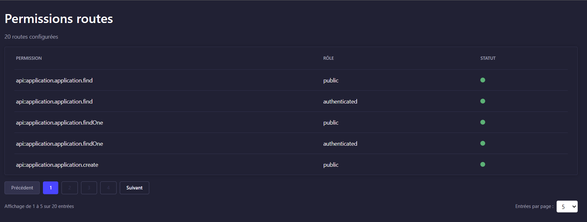
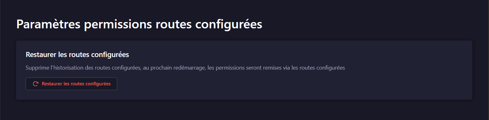
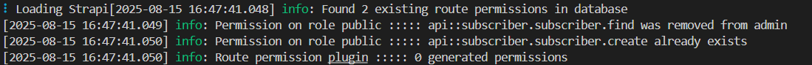

# strapi5-plugin-route-permission

Inspired from [strapi-plugin-route-permission](https://github.com/andreciornavei/strapi-plugin-route-permission), same plugin but for strapi V3.

For strapi v4 : [strapi4-plugin-route-permission](https://github.com/PaulRichez/strapi4-plugin-route-permission)

A plugin for [Strapi](https://github.com/strapi/strapi) that provides the ability to config roles on server route for generate permissions with advanced management features.

[](https://www.npmjs.com/package/strapi5-plugin-route-permission)
[](https://github.com/PaulRichez/strapi5-plugin-route-permission/blob/main/LICENSE)

## 🚀 &nbsp; _Overview_

This plugin implements a simple way to seed strapi users-permissions from routes configuration (only server). It means that you can define your routes permissions directly on route files. Every time your server starts, it will recreate your routes permissions from your route config, allowing you to migrate your application without worrying about redefining your routes permissions over strapi panel.

### ✨ Key Features

- 🔄 **Automatic Permission Sync**: Synchronizes route permissions on server startup
- 🎯 **Custom Pagination**: Advanced pagination with configurable page sizes
- 🔍 **Advanced Filtering**: Filter by roles, methods, and permission status
- 🔍 **Smart Search**: Button-based search with debouncing
- 📊 **Status Indicators**: Visual status indicators with colored badges
- 🧹 **Cleanup Options**: Soft and hard cleanup for external permissions
- ⚡ **Instant Operations**: Settings operations without server restart

⚠️ **Note**: This plugin creates route permissions automatically on startup. It can also clean up external permissions through the admin panel, but does not automatically delete route permissions during normal operation.

---

## ⏳ &nbsp; _Installation_

With npm:

```bash
npm install strapi5-plugin-server-route-permission
```

With yarn:

```bash
yarn add strapi5-plugin-server-route-permission
```

---

## ✨ &nbsp; _Getting Started_

Add an array of roles on each route configuration

### Examples:

Core route example :

```js
"use strict";

/**
 * subscriber router
 */

import { factories } from '@strapi/strapi';

export default factories.createCoreRouter('api::subscriber.subscriber', {
    config: {
        create: {
            // @ts-ignore
            roles: ['public']
        },
        find: {
            // @ts-ignore
            roles: ['public']
        },
    },
});
```

### 🔧 Plugin Configuration

You can configure the plugin's bootstrap behavior by setting the `bootstrapMode` in your plugin configuration:

```typescript
// config/plugins.ts
export default () => ({
  'strapi5-plugin-route-permission': {
    enabled: true,
    resolve: './src/plugins/strapi5-plugin-route-permission',
    config: {
      bootstrapMode: 'default' // 'default' | 'restore' | 'soft' | 'hard'
    }
  },
});
```

#### Bootstrap Modes:

- **`default`** (Default): Only synchronizes new permissions, preserves existing ones
- **`restore`**: Clears plugin history and recreates all route permissions
- **`soft`**: Removes external permissions while preserving native Strapi permissions, then syncs
- **`hard`**: Removes ALL external permissions, keeping only plugin-managed ones (use with caution)

📖 **For detailed configuration options, see [CONFIGURATION.md](./CONFIGURATION.md)**

---

## �️ &nbsp; _Admin Panel Features_

### Main Dashboard

The main dashboard provides a comprehensive view of all configured routes with advanced filtering and pagination:



#### Status Indicators

Each route displays a status indicator with colored badges:

- 🟢 **Green Badge**: Permission is properly configured and active
- � **Red Badge**: Permission is missing or disabled
- � **Yellow Badge**: Role doesn't exist
- 🔵 **Blue Badge**: External permission (not managed by this plugin)

#### Filtering Options

- **Role Filter**: Filter routes by specific roles (Public, Authenticated, etc.)
- **Method Filter**: Filter by HTTP methods (GET, POST, PUT, DELETE)
- **Status Filter**: Filter by permission status
- **Search**: Search routes by path, action, or description

#### Pagination

- **Custom Pagination**: Configurable page sizes (10, 25, 50, 100 items per page)
- **Navigation**: Previous/Next buttons with page indicators
- **Total Count**: Display total number of routes and current page info

### Settings Page

Advanced management options available in the settings:



#### Restore Permissions
- **Full Restore**: Removes configured routes history and reconfigures all routes
- **Instant Operation**: No server restart required
- **Safe Operation**: Preserves existing permissions while syncing new ones

#### Cleanup External Permissions

**Soft Cleanup** (Recommended):
- Removes only non-native external permissions
- Preserves Strapi native permissions (users-permissions, auth, etc.)
- Preserves API permissions (`api::*`)
- Safe for production use

**Hard Cleanup** (Use with caution):
- Removes ALL external permissions not managed by this plugin
- Only preserves permissions explicitly managed by this plugin
- ⚠️ **Warning**: May break other plugins or custom permissions

#### Available Actions

1. **Restore Permissions**: Synchronizes all route permissions
2. **Soft Cleanup**: Removes non-essential external permissions
3. **Hard Cleanup**: Removes all external permissions (advanced users only)

---

## 🎉 &nbsp; _Result_

On strapi startup it adds only new permissions configured in your route config:



### Console Output Example

```
[2025-01-15 10:30:15.123] info: Found 25 existing route permissions in database
[2025-01-15 10:30:15.456] info: Permission on role public ::::: api::subscriber.subscriber.create already exists
[2025-01-15 10:30:15.789] info: Generating permission on role authenticated ::::: api::post.post.find
[2025-01-15 10:30:16.012] info: Route permission sync ::::: 3 created, 22 synced permissions
```

---

## 🔧 &nbsp; _API Endpoints_

The plugin provides several API endpoints for programmatic access:

- `GET /api/strapi5-plugin-route-permission/configured-routes` - Get all configured routes with filtering
- `POST /api/strapi5-plugin-route-permission/restore` - Restore permissions
- `POST /api/strapi5-plugin-route-permission/cleanup-soft` - Soft cleanup external permissions
- `POST /api/strapi5-plugin-route-permission/cleanup-hard` - Hard cleanup external permissions

---

## 🐛 &nbsp; _Bugs_

If any bugs are found please report them as a [Github Issue](https://github.com/PaulRichez/strapi5-plugin-route-permission/issues)

### Typescript Support

You can put this line above the role property: `// @ts-ignore`

---

## 📝 &nbsp; _Changelog_

### Latest Features

- ✅ Custom pagination system
- ✅ Advanced filtering (role, method, status)
- ✅ Button-based search with debouncing
- ✅ Status indicators with colored badges
- ✅ Instant settings operations
- ✅ Soft/Hard cleanup options
- ✅ Improved error handling
- ✅ Enhanced user interface

---

## 🤝 &nbsp; _Contributing_

Contributions, issues and feature requests are welcome!

---

## 📄 &nbsp; _License_

This project is licensed under the MIT License - see the [LICENSE](LICENSE) file for details.

Copyright (c) 2025 Paul Richez
